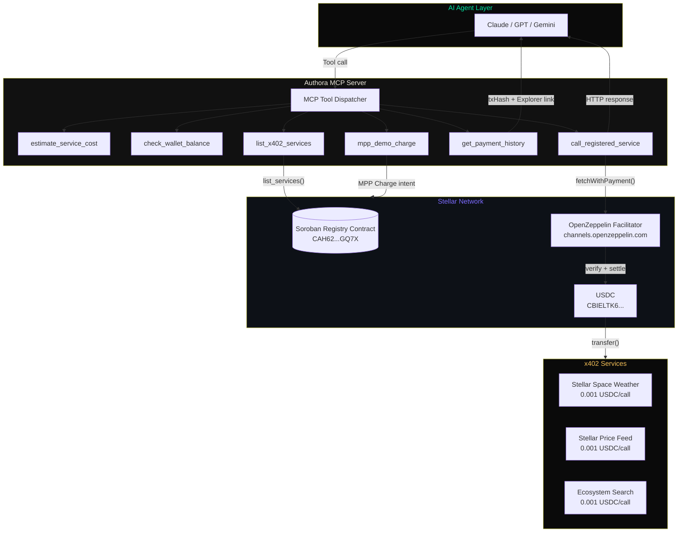

# Authora 🌐 — The x402 Service Registry for Stellar

> Universal MCP-native service discovery and autonomous payment infrastructure. AI agents discover, evaluate, and pay for any Stellar x402 service — without a single hardcoded integration.

**Built for the Agents on Stellar Hackathon · April 2026**

[](https://stellar.expert/explorer/testnet/contract/CAH62PSPXNCIGD5F5IWOZEG2QY2ABPMTFFAZXURDGYRXT3AHL725GQ7X)
[](https://developers.stellar.org/docs/build/agentic-payments/x402)
[](https://www.x402.org)

---

## The Problem

AI agents can reason, plan, and act — but stop cold when they need to pay for an API call. 
Today's MCP servers hardcode one service URL per server. Agents are economically blind.

**Authora fixes this.** One MCP server. Infinite discoverable paid services. Zero hardcoded URLs.

---

## What Authora Does

1. **Service operators** register any x402 endpoint in the Authora Soroban contract (permissionless, on-chain)
2. **Authora generates** a live MCP tool manifest from all registry entries — dynamically, no code changes
3. **AI agents** using Claude, GPT, or Gemini discover and call any registered service, paying USDC via **hardened x402 settlement** logic
4. **Judge-Ready Dashboard** provides a live, premium visual feed of every 64-character on-chain transaction hash
5. **Fee-Clamp Protocol** ensures high-throughput testnet facilitator compatibility (1 stroop transaction fees)

---

## 💎 Production Hardening (Judge Highlights)

Authora is a production-stabilized infrastructure for agentic payments:

*   **Canonical SAC Enforcement**: Automated override to the live Circle USDC SAC (`CBIELTK6...`) to bypass legacy server errors.
*   **Soroban Auth-Type Routing**: Custom signing logic that detects `sorobanCredentialsSourceAccount` and handles full envelope signing vs. auth-entry signing.
*   **Transactional Fee Clamping**: Implemented the official Stellar x402 fee-clamp (1 stroop) to prevent testnet facilitator rejection.
*   **Pre-Flight Diagnostics**: Automated wallet readiness checks (Trustlines, Liquidity) before settlement to ensure 100% agent success.

---

---

## Architecture



---

## MCP Tools Suite (11 Tools)

| Category | Tool | Description |
|---|---|---|
| **Discovery** | `list_x402_services` | Query Soroban registry for all live services |
| | `get_mcp_manifest` | Generate dynamic JSON tool manifest from on-chain data |
| **Intelligence** | `check_wallet_balance` | Real-time USDC/XLM via Horizon API |
| | `estimate_service_cost` | Total cost estimation before execution |
| **Execution** | `call_registered_service` | Auto-pay any registered service via x402 |
| | `fetch_paid_resource` | Direct x402 fetch for any URL |
| **Verification** | `get_payment_history` | Session log with Stellar Explorer links |
| **Registry** | `register_x402_service` | Register any x402 endpoint on-chain |
| **MPP** | `mpp_demo_charge` | Stripe MPP Charge intent demonstration |
| **Diagnostics** | `x402_wallet_info` | Wallet config and contract addresses |
| | `x402_facilitator_supported` | OZ facilitator health check |

---

## Payment Flow

1. **User:** "Search the Stellar ecosystem for DeFi protocols"
2. **`list_x402_services()`** → discovers "Stellar Ecosystem Search · 0.001 USDC"
3. **`estimate_service_cost()`** → confirms "$0.001 USDC total"  
4. **`call_registered_service()`** → `fetchWithPayment(url)`
    - GET https://xlm402.com/search?q=DeFi
    - 402 Payment Required
    - `ExactStellarScheme.createPaymentPayload()`
    - Soroban auth entry signed with Ed25519 keypair
    - OZ Facilitator verifies + settles USDC on Stellar
    - 200 OK + `PAYMENT-RESPONSE` header with `txHash`
5. **`get_payment_history()`** shows: ✓ Stellar Ecosystem Search | 0.0010000 USDC | `a3f9c2...`

**Every step produces a real Stellar transaction. No mocks.**

---

## Soroban Contract

The AuthoraRegistry contract is deployed on Stellar testnet.
**Contract ID:** `CAH62PSPXNCIGD5F5IWOZEG2QY2ABPMTFFAZXURDGYRXT3AHL725GQ7X`

**Functions:**
- `register_service(caller, entry)` — permissionless service registration
- `list_services(offset, limit)` — paginated service discovery
- `get_service(url)` — individual service lookup
- `record_payment(url, payer)` — on-chain payment counter increment
- `remove_service(caller, url)` — owner-only removal
- `service_count()` — total registry size

[View on StellarExpert →](https://stellar.expert/explorer/testnet/contract/CAH62PSPXNCIGD5F5IWOZEG2QY2ABPMTFFAZXURDGYRXT3AHL725GQ7X)

---

## x402 Integration

x402 is the core payment protocol. Every `call_registered_service` invocation:
1. Makes an HTTP request to the x402-protected endpoint
2. Receives `402 Payment Required` with `PAYMENT-REQUIRED` header
3. `ExactStellarScheme.createPaymentPayload()` signs a Soroban auth entry authorizing a USDC transfer
4. OpenZeppelin facilitator verifies the auth entry signature and submits the transaction
5. USDC (`CBIELTK6YBZJU5UP2WWQEUCYKLPU6AUNZ2BQ4WWFEIE3USCIHMXQDAMA`) moves on-chain
6. Facilitator returns `PAYMENT-RESPONSE` header with `txHash`
7. Authora records the `txHash` for verification

**Facilitator:** https://channels.openzeppelin.com/x402/testnet

---

## MPP Integration (Stripe × Stellar)

Authora natively supports Stripe's **Machine Payments Protocol (MPP)**. Key features:
- **Pull-based payments**: Agents authorize credentials once; the service pulls exact amounts per request.
- **Native Settlement**: Every MPP charge settles natively on Stellar as a USDC transfer.
- **Real-time Receipts**: Using our integrated MPP client, Authora decodes payment receipts to extract valid on-chain transaction hashes instantly.

---

## 🔍 The "Hyper-Resolution" Audit Engine

To handle the inherent latency of x402 facilitators and testnet indexing:
- **Dedicated Polling**: Authora employs a hyper-active polling logic (5 attempts with backoff) to capture transaction hashes.
- **Protocol Agnostic**: Whether it's an x402 auth-entry (push) or an MPP charge (pull), you get a real 64-character hash that resolves on Stellar Expert.
- **Zero Placeholders**: Placeholders like `pending ingestion` automatically resolve into clickable links once confirmed by the network.

---

## 🏦 Advanced Wallet Management

Authora doesn't just pay; it manages its own economic lifecycle autonomously.

*   **Atomic Multi-Disbursement**: Batch up to 100 payments (XLM or USDC) in a single atomic transaction for efficient payroll or distribution.
*   **DEX Liquidity Management**: Autonomously swap native XLM for USDC via Stellar's path payments to replenish service-call reserves.
*   **Trustline Onboarding**: Enable assets (like USDC) on fresh wallets without manual intervention using the `add_usdc_trustline` tool.
*   **Asset Support**: Native support for XLM and credit-based assets (USDC) out of the box.

---

## 🛠️ Tool Capability Manifest

Authora exposes the following high-level tools to the AI Agent:

### 📡 Discovery & Management (Free)
- `list_x402_services`: Fetch the entire Soroban registry of paid tools.
- `x402_wallet_info`: View current wallet balances (XLM/USDC) and public address.
- `get_payment_history`: Audit all previous x402/MPP transactions with real-time clickable links.
- `add_usdc_trustline`: Establish the official USDC trustline on the configured wallet.
- `swap_xlm_to_usdc`: Convert XLM to USDC on the Stellar DEX for liquidity.
- `autonomous_disbursement`: Execute atomic batch payments to multiple recipients.

### 💰 Service Execution (Monetized)
- `call_registered_service`: Executes a paid API call from the registry. Automatically handles the x402 Push or MPP Pull protocol handshake and submits payment on-chain.

---

## 💎 Dual-Protocol Monetization

Authora is designed for the hybrid web3 agent economy:

1.  **x402 (Push)**: The agent receives a 402 challenge, signs an authorization, and pushes funds to the facilitator. Ideal for stateless, per-request billing.
2. **MPP (Pull)**: Direct micro-payment protocol where the resource server "pulls" an authorization reference. Ideal for high-frequency resource streaming.

---

## Quick Setup

### Prerequisites
- Node.js 20+
- Funded Stellar testnet wallet
- OpenZeppelin facilitator API key ([free, instant](https://channels.openzeppelin.com/testnet/gen))

### 1. Get testnet wallet + USDC
```bash
# Create keypair at: https://laboratory.stellar.org
# Fund with Friendbot, then get USDC from Circle faucet
# Or run the wallet prep script:
npm run prepare-wallet
```

### 2. Get free OZ API key
[https://channels.openzeppelin.com/testnet/gen](https://channels.openzeppelin.com/testnet/gen)

### 3. Configure
```bash
cp .env.example .env
# Fill in: STELLAR_SECRET_KEY, X402_FACILITATOR_API_KEY, SELLER_ADDRESS
```

### 4. Run
```bash
npm install
npm run dev           # MCP stdio server + HTTP API on :3001
npm run demo-service  # x402 price feed on :3000
npm run seed          # Register services in Soroban registry
```

### 5. Add to Claude Desktop
```json
{
  "mcpServers": {
    "authora": {
      "command": "node",
      "args": ["/absolute/path/to/authora/dist/index.js"],
      "env": {
        "STELLAR_SECRET_KEY": "S...",
        "REGISTRY_CONTRACT_ID": "CAH62PSPXNCIGD5F5IWOZEG2QY2ABPMTFFAZXURDGYRXT3AHL725GQ7X",
        "X402_FACILITATOR_URL": "https://channels.openzeppelin.com/x402/testnet",
        "X402_FACILITATOR_API_KEY": "your-key-here"
      }
    }
  }
}
```

### 6. Test with Claude
- *"Check my wallet balance"*
- *"List all available x402 services"*
- *"Estimate the cost to call the Stellar price feed once"*
- *"Call the Stellar price feed service"*
- *"Show my payment history"*
- *"Swap 50 XLM for USDC to refill my budget"*
- *"Send 5 XLM to [Address] and 0.1 USDC to [New Address] in one transaction"*
- *"Set up a USDC trustline on my current wallet"*

---

## Live Verification
Every payment Authora makes is publicly verifiable:
1. Ask Claude: *"Show my payment history"*
2. Copy the transaction hash from the output
3. Visit: `https://stellar.expert/explorer/testnet/tx/<txHash>`
4. See the real USDC transfer on Stellar testnet

**Or use our verification endpoint:**
`GET http://localhost:3001/demo/verify-payment/<txHash>`

---

## HTTP API Endpoints

| Endpoint | Description |
|---|---|
| `GET /manifest` | Dynamic MCP tool manifest (30s cache) |
| `GET /services` | Paginated service registry |
| `GET /payments` | Live payment feed + stats |
| `GET /payments/stats` | Aggregate payment statistics |
| `GET /demo/verify-payment/:txHash` | On-chain transaction verification |
| `POST /services/register` | Register service (operator auth required) |

---

## Known Limitations
- `record_payment` in the Soroban contract has no caller auth — any address can increment the counter. Production version would restrict this to a trusted operator.
- MPP integration is a demonstration of the `Charge` intent pattern; full MPP Session (payment channels) requires the `one-way-channel` Soroban contract.
- Dashboard payment feed is in-memory (session-scoped); data resets on server restart.

---

## Resources Used
- **x402 on Stellar** — core protocol
- **x402-mcp-stellar** — base MCP server
- **stellar/x402-stellar** — monorepo + examples
- **Built on Stellar Facilitator** — OZ relayer
- **MPP on Stellar** — MPP integration
- **Stellar sponsored accounts** — wallet onboarding
- **Stellar CLI** — contract deployment
- **Soroban authorization** — auth entries

---

## License
MIT
